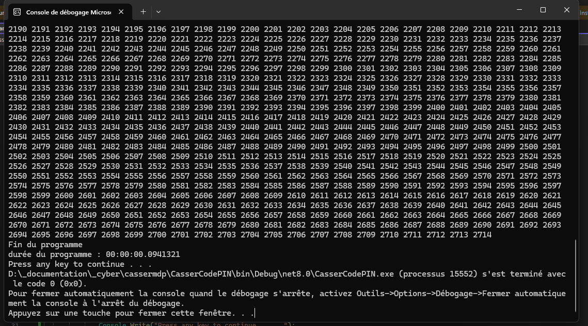

# CSharp

## Mission 2 :

- le programme calcule le temps entre le lancement et la fin de celui ci
- 00:00:00.0123030
- 12.3030 millisecondes

## Mission 3&4

- 

    
  

- 0,0941321 seconde

## Mission 5 :

- 00:00:30.0277848
- 00:01:52.0775858 thread a 1 milliseconde
- ça rend plus rapide la trouvaille des mot de passe

# PHP

## Mission 2 :

- le programme calcule le temps entre le lancement et la fin de celui ci
- [temps obtenu] seconde
- [temps obtenu] millisecondes

## Mission 3&4 :

- le programme génère un code pin aléatoire entre 0 et 9999
- la boucle while teste les nombres jusqu'à trouver le bon code
- [temps obtenu] seconde

## Mission 5 :

- [temps obtenu] avec une pause de 5 millisecondes
- la temporisation rend plus lente la trouvaille du code pin
- plus on augmente la temporisation plus l'attaque prend du temps

# Python

## Mission 2 :

- le programme calcule le temps entre le lancement et la fin de celui ci
- [temps obtenu] seconde
- [temps obtenu] millisecondes

## Mission 3&4 :

- le programme génère un code pin aléatoire entre 0 et 9999
- la boucle while essaye les codes un par un jusqu'à trouver le bon
- [temps obtenu] seconde

## Mission 5 :

- [temps obtenu] avec une pause de 5 millisecondes
- ça rend plus lente la trouvaille du code pin
- la temporisation permet de ralentir une attaque par force brute
